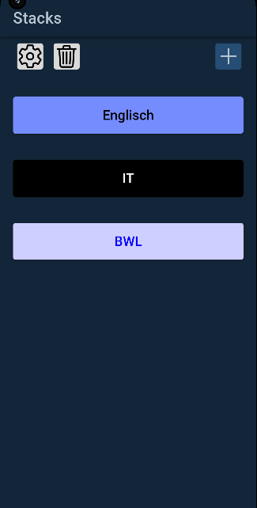
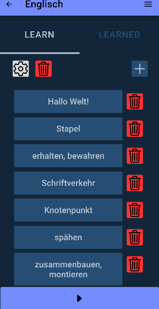
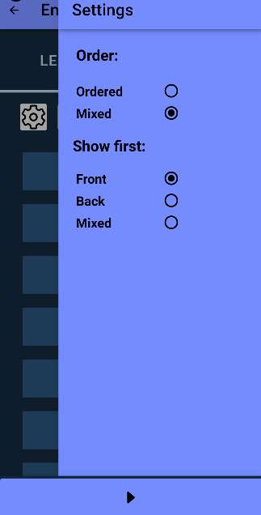
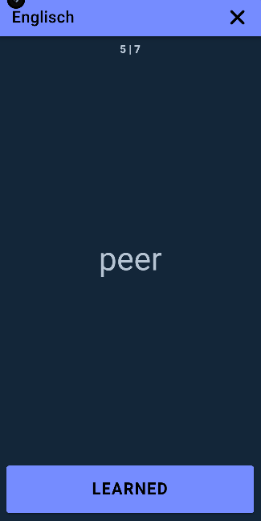

# leards

A simple lightweight flashcards Android App with Angular, Capacitor, Ionic.

## Stack list Page
- Add, remove or edit Stacks

## Stack detail Page
Overview of learned and unlearned cards   
Add, remove or edit Cards  
  

Settings that determine the order and display of the cards when swiping through  
  

## Stack learning Page
 
